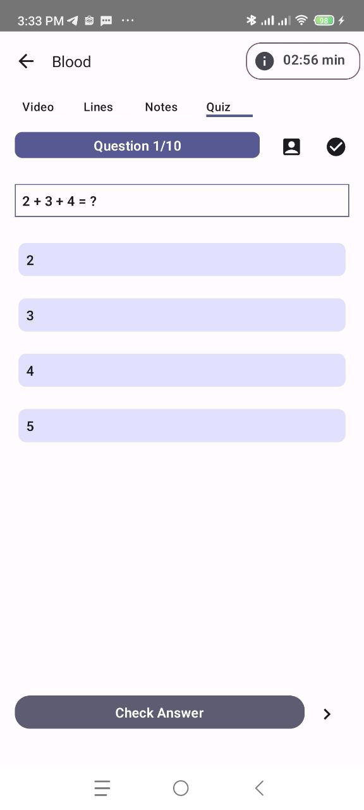
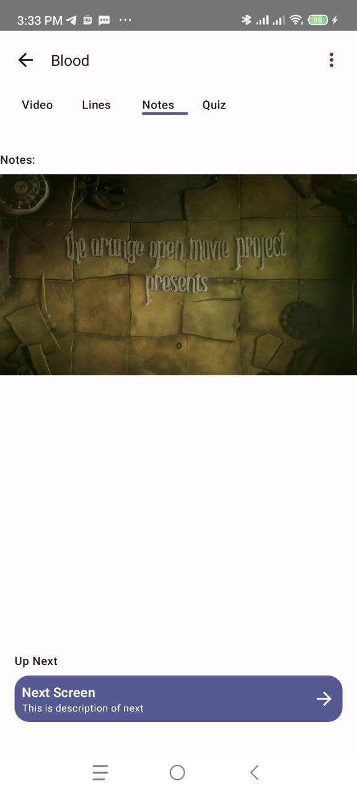
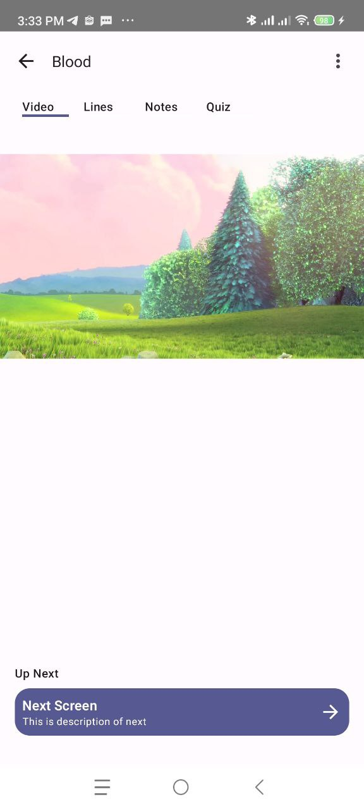
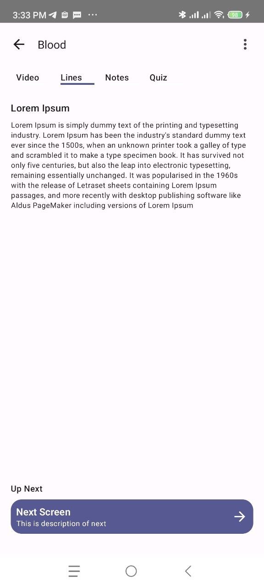
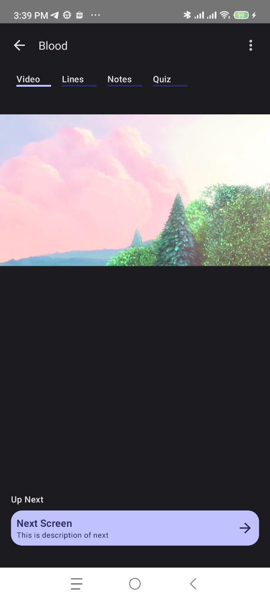
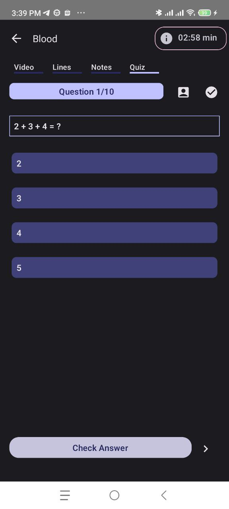

# Video-Client-App

This is video client app for android
## Stack
- Jetpack Compose
- MVVM
- ExoPlayer
- Modular

## Feature Capsule
- Preview Video
- Content Description
- Quiz and Check Answer detection
- Darkmode suport

## Sample Data Structure
```kotlin
sealed class StatePreview {
    abstract val title: String
    abstract val upNext: UpNext?
    data class Video(
        val uri: Uri,
        override val upNext: UpNext?,
        override val title: String
    ): StatePreview()

    data class Notes(
        val uri: Uri,
        override val upNext: UpNext?, override val title: String
    ): StatePreview()

    data class Lines(
        override val upNext: UpNext?,
        override val title: String,
        val headLine: String,
        val text: String
    ): StatePreview()

    data class Quiz(
        override val upNext: UpNext?, override val title: String,
        val questions: List<Question>
    ): StatePreview()

}

data class UpNext(val next: StatePreview, val title: String, val description: String)

data class Question (
    val question: String,
    val option: List<String>
) {
    var correct = option[(option.indices).random()]
}
```

## Screenshot




## Todo Items
- Add Unit test
- Add Compose UI Test
